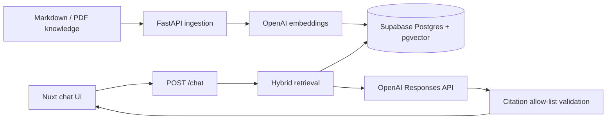

# Service Notes — Restaurant Operations RAG

[English](README.md) | [繁體中文](README.zh-TW.md)

A citation-first, Traditional Chinese RAG portfolio project for restaurant employees. It retrieves fictional menu, safety, equipment, and branch SOP documents; answers only from retrieved evidence; and exposes every supporting source to the user.

## What this demonstrates

- A custom ingestion and retrieval pipeline without LangChain or hosted file search
- OpenAI `text-embedding-3-small` embeddings stored in Supabase Postgres with pgvector
- Hybrid retrieval using cosine similarity, PostgreSQL full-text search, and trigram similarity
- OpenAI Responses API with Pydantic Structured Outputs
- Application-side citation validation and explicit abstention
- Transactional citation snapshots that remain auditable after source re-ingestion
- Branch metadata filtering, rate limiting, usage logging, and a reproducible 31-case evaluation set
- A deliberately small Nuxt 3 interface suitable for a live interview demo

## Why this project exists

The goal is not to make a general-purpose restaurant chatbot. The project focuses on the parts of RAG that can be measured and explained in an interview: document parsing, chunking, hybrid retrieval, branch isolation, grounded generation, citation validation, abstention, observability, and repeatable evaluation.

## Architecture



## Local setup

Requirements: Python 3.11+, Node.js 20+, an OpenAI API key, and a Supabase Postgres project.

1. Copy `.env.example` to `.env` and configure `OPENAI_API_KEY`, `DATABASE_URL`, and `ADMIN_SECRET`.
2. Enable direct database connections in Supabase. If the connection string uses a pooler, use a session-mode pooler because the backend maintains its own small pool.
3. Install and initialize the backend:

```bash
cd backend
python -m venv .venv
source .venv/bin/activate
pip install -e '.[dev]'
python -m app.cli migrate
python -m app.cli ingest --path ../knowledge
uvicorn app.main:app --reload --port 8000
```

4. In another terminal, start the frontend:

```bash
cd frontend
cp .env.example .env
npm install
npm run dev
```

Open `http://localhost:3000`. Interactive API documentation is available at `http://localhost:8000/docs`.

## API

| Method | Path | Purpose | Protection |
|---|---|---|---|
| `GET` | `/health` | Database and configuration health | Public |
| `POST` | `/chat` | Retrieve evidence and answer a question | Per-IP daily limit |
| `POST` | `/admin/ingest` | Index the server-side knowledge directory | `X-Admin-Secret` |
| `POST` | `/evaluations/run` | Run the fixed evaluation set | `X-Admin-Secret` |
| `GET` | `/evaluations/latest` | Read the latest persisted evaluation run | `X-Admin-Secret` |
| `GET` | `/metrics/summary` | Aggregate latency and token usage | `X-Admin-Secret` |

Example:

```bash
curl http://localhost:8000/chat \
  -H 'Content-Type: application/json' \
  -d '{"question":"台北店星期六最後點餐幾點？","branch_id":"taipei"}'
```

Run a small evaluation smoke test before running all 31 paid cases:

```bash
curl http://localhost:8000/evaluations/run \
  -H 'Content-Type: application/json' \
  -H "X-Admin-Secret: $ADMIN_SECRET" \
  -d '{"limit":3}'
```

## Retrieval and grounding contract

1. The query is embedded with the same model used at ingestion.
2. SQL filters out documents belonging to other branches.
3. Semantic, full-text, and trigram scores are combined into a top-eight candidate list.
4. Only the top five chunks are sent to the response model.
5. The model must return chunk UUIDs in a strict Pydantic schema.
6. The API removes any UUID not present in the retrieved context. A non-abstaining answer with no valid citation is converted to an abstention.
7. The answer and its ordered citation snapshots are committed in one transaction. The returned `trace_id` is the corresponding `chat_logs.id`.

Each document also has a numeric `source_id` for display. The UI renders that database value in brackets with the document title, while UUIDs remain internal. `chat_citations` snapshots the `source_id`, title, section, excerpt, and supporting statement as they existed when the answer was generated. If a later ingestion removes the original chunk, its foreign key becomes `NULL` but the historical snapshot remains intact.

The defaults are a starting baseline. Use the evaluation set to tune chunk size, semantic threshold, candidate count, and score weights rather than treating them as universal constants.

### Request flow

```text
Nuxt UI
  -> POST /chat
  -> embed the question
  -> branch-filtered hybrid search in Postgres
  -> retrieve 8 candidates
  -> send the best 5 chunks as model context
  -> generate a structured answer
  -> validate citation UUIDs against the supplied context
  -> transactionally save the answer and citation snapshots
  -> render the answer and human-readable source IDs
```

### Hybrid retrieval

The current baseline weights semantic similarity at `0.72` and lexical relevance at `0.28`. Lexical relevance combines PostgreSQL full-text ranking and trigram similarity. These values are engineering defaults, not universal RAG constants: semantic search handles paraphrases, while lexical search helps with exact terms such as allergens, temperatures, times, menu names, and POS terminology.

## Evaluation

The fixed dataset in `backend/evals/cases.json` contains 31 cases covering direct answers, paraphrases, exact facts, branch isolation, unsupported questions, compound questions, and abstention. The automated endpoint reports:

- Recall@5 for the expected source document
- Correct abstention rate
- Citation validity rate
- Average end-to-end latency
- Per-case retrieved and cited documents, pass/fail flags, answer, reason, and latency

Save a complete run for later review:

```bash
curl http://localhost:8000/evaluations/run \
  -H 'Content-Type: application/json' \
  -H "X-Admin-Secret: $ADMIN_SECRET" \
  -d '{}' > docs/evaluation-results-latest.json
```

`retrieval_passed` is `null` for unsupported cases that do not declare an expected source. `overall_passed` combines retrieval (when applicable), abstention, and citation validity; it does not yet judge semantic answer correctness.

Each run is saved transactionally to Supabase. `evaluation_runs` stores the summary and model, while `evaluation_case_results` stores every case. The response includes a `run_id`; if either insert fails, the whole run is rolled back. Retrieve the newest saved run with:

```bash
curl http://localhost:8000/evaluations/latest \
  -H "X-Admin-Secret: $ADMIN_SECRET"
```

### Latest automated run (July 1, 2026)

| Metric | Result |
|---|---:|
| Cases passing automated criteria | 31 / 31 |
| Recall@5 | 100% |
| Correct abstention rate | 100% |
| Citation validity rate | 100% |
| Average end-to-end latency | 4,588 ms |

These scores cover retrieval, abstention, and citation integrity. They do not claim 100% semantic answer accuracy. See [`docs/evaluation-report.md`](docs/evaluation-report.md) for definitions and limitations.

An initial 29-question exploratory run on July 1, 2026 produced the following operational snapshot. It is included as a baseline rather than a final benchmark because answer correctness still requires labelled expected answers or human review.

| Metric | Result |
|---|---:|
| Answered requests | 20 |
| Abstained requests | 9 |
| Average total latency | 5,551 ms |
| Average retrieval latency | 2,626 ms |
| Average generation latency | 2,924 ms |
| Average input tokens | 1,398 |
| Average output tokens | 249 |
| Citation IDs contained in retrieved results | 100% |

The exploratory run correctly refused unsupported requests for live inventory, revenue, private contact details, and future menu plans. It also avoided inferring a closing time from an opening time and a last-order time.

When investigating a failed case, use this order:

```text
Expected chunk missing from top 8       -> retrieval problem
Expected chunk retrieved but not top 5  -> ranking/context selection problem
Expected chunk present in model context -> prompt or generation problem
Answer supported but citation incorrect -> citation mapping problem
Unsupported answer was generated        -> abstention problem
```

## Known limitations

- Aggregate or live questions such as current inventory, revenue, and menu-item counts should use structured data and SQL rather than asking the model to count incomplete text chunks.
- Compound questions currently use a conservative all-or-nothing policy. If one part lacks evidence, the whole response may be marked as abstained and partial-answer citations are not retained.
- Conflict handling can only be evaluated when both contradictory chunks are retrieved into the model context.
- Ingestion replaces a changed document's chunks, so their UUIDs can change. Historical citation text remains available through immutable snapshots.
- The in-memory per-IP rate limiter is suitable for a single demo instance, not horizontally scaled production deployment.
- Evaluation currently measures retrieval, abstention, citation validity, and latency; fully automated semantic answer correctness remains future work.

Investigation notes and regression decisions are recorded in [`docs/experiment-log.md`](docs/experiment-log.md).

## Tests

```bash
cd backend && pytest && ruff check .
cd ../frontend && npm run test && npm run typecheck && npm run build
```

Backend tests cover document parsing, rate limiting, low-relevance abstention, citation hydration, and hallucinated citation rejection. Frontend tests cover API error normalization; the production build verifies the complete chat page and responsive styles.

## Deployment

- **Database:** run `python -m app.cli migrate`. The runner applies every unapplied SQL file in order and records it in `schema_migrations`; then run ingestion from a trusted machine.
- **API:** `render.yaml` deploys `backend/Dockerfile`. Configure secrets in the Render dashboard.
- **Web:** deploy `frontend/` to a Nuxt-compatible host and set `NUXT_PUBLIC_API_BASE` to the public API URL.
- Set backend `ALLOWED_ORIGINS` to the exact frontend origin.
- Set an OpenAI project budget/alert in addition to the application request limit. The in-memory limiter is intentionally demo-scale; use Redis or an API gateway before horizontal scaling.

For the complete Render and Vercel walkthrough, see [`docs/deployment-guide.zh-TW.md`](docs/deployment-guide.zh-TW.md).

## Data and safety

All restaurant names, procedures, and operational data are fictional. The UI reminds users to follow source SOPs and a duty manager for food-safety or emergency decisions. This project is a portfolio demonstration, not production restaurant policy.
