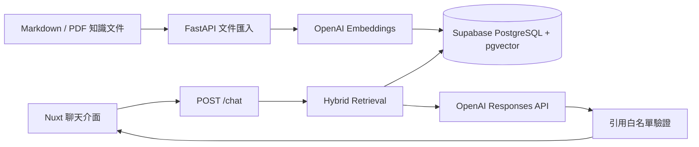

# Service Notes — 餐廳營運 RAG 助手

[English](README.md) | [繁體中文](README.zh-TW.md)

這是一個以可靠引用為核心、使用繁體中文操作的餐廳營運 RAG 作品。系統會檢索虛構的菜單、食品安全、設備操作與分店 SOP 文件，只根據找到的證據回答，並向使用者呈現實際引用來源。

## 線上展示

- 前端：[restaurant-operations-rag.vercel.app](https://restaurant-operations-rag.vercel.app/)
- API 健康檢查：[restaurant-rag-api.onrender.com/health](https://restaurant-rag-api.onrender.com/health)
- 互動式 API 文件：[restaurant-rag-api.onrender.com/docs](https://restaurant-rag-api.onrender.com/docs)

公開 API 使用 Render Free instance，閒置後第一次開啟可能需要短暫等待冷啟動。

## 作品展示重點

- 不使用 LangChain 或託管式 File Search，自行實作文件匯入與檢索流程
- 使用 OpenAI `text-embedding-3-small` 建立向量，儲存在 Supabase PostgreSQL 與 pgvector
- 結合向量相似度、PostgreSQL 全文搜尋與 trigram similarity 的 Hybrid Search
- 使用 OpenAI Responses API 與 Pydantic Structured Outputs
- 後端驗證引用並在資料不足時明確拒答
- 以 transaction 保存 citation snapshot，重新匯入文件後仍可追溯歷史引用
- 支援分店資料隔離、rate limit、使用紀錄與可重複執行的 25 題核心評估集
- 使用 Nuxt 3 製作簡潔、適合面試展示的聊天介面

## 專案目的

這個作品不是要製作一個什麼都能回答的餐廳聊天機器人，而是展示可以量化與解釋的 RAG 工程能力：文件解析、切片、Hybrid Retrieval、分店隔離、Grounded Generation、引用驗證、拒答、可觀測性與評估。

## 系統架構



## 本機安裝

需求：Python 3.11 以上、Node.js 20 以上、OpenAI API Key，以及一個 Supabase PostgreSQL 專案。

1. 將根目錄的 `.env.example` 複製為 `.env`，設定 `OPENAI_API_KEY`、`DATABASE_URL` 與 `ADMIN_SECRET`。
2. 在 Supabase 啟用資料庫連線。若使用 pooler，請選擇 session mode，因為後端本身已維護一個小型 connection pool。
3. 安裝並初始化後端：

```bash
cd backend
python -m venv .venv
source .venv/bin/activate
pip install -e '.[dev]'
python -m app.cli migrate
python -m app.cli ingest --path ../knowledge
uvicorn app.main:app --reload --port 8000
```

4. 開啟另一個終端機啟動前端：

```bash
cd frontend
cp .env.example .env
npm install
npm run dev
```

前端網址為 `http://localhost:3000`，互動式 API 文件位於 `http://localhost:8000/docs`。

## API

| 方法 | 路徑 | 用途 | 保護方式 |
|---|---|---|---|
| `GET` | `/health` | 檢查資料庫與環境設定 | 公開 |
| `POST` | `/chat` | 檢索資料並回答問題 | 每個 IP 的每日限制 |
| `POST` | `/admin/ingest` | 索引伺服器端知識文件 | `X-Admin-Secret` |
| `POST` | `/evaluations/run` | 執行固定評估集 | `X-Admin-Secret` |
| `GET` | `/evaluations/latest` | 讀取最近一次保存的評估 | `X-Admin-Secret` |
| `GET` | `/metrics/summary` | 查看平均延遲與 Token 用量 | `X-Admin-Secret` |

呼叫範例：

```bash
curl http://localhost:8000/chat \
  -H 'Content-Type: application/json' \
  -d '{"question":"台北店星期六最後點餐幾點？","branch_id":"taipei"}'
```

在執行全部 25 題的付費評估前，可以先執行 3 題 smoke test：

```bash
curl http://localhost:8000/evaluations/run \
  -H 'Content-Type: application/json' \
  -H "X-Admin-Secret: $ADMIN_SECRET" \
  -d '{"limit":3}'
```

## 檢索與回答流程

1. 使用與文件匯入時相同的模型將問題轉成向量。
2. SQL 先排除其他分店的專屬文件。
3. 合併語意、全文與 trigram 分數，取出前 8 個候選 chunks。
4. 只將排名最高的 5 個 chunks 傳給回答模型作為 context。
5. 模型必須按照嚴格的 Pydantic schema 回傳 chunk UUID。
6. API 會移除不在本次 context 中的 UUID；若回答沒有任何有效引用，則強制改為拒答。
7. 回答與依序排列的 citation snapshots 會在同一個 transaction 中寫入；回傳的 `trace_id` 對應 `chat_logs.id`。

```text
Nuxt UI
  -> POST /chat
  -> 將問題轉成向量
  -> 在 PostgreSQL 執行有分店篩選的 Hybrid Search
  -> 取回 8 個候選 chunks
  -> 將最好的 5 個 chunks 作為模型 context
  -> 產生結構化回答
  -> 驗證引用 UUID 是否存在於 context
  -> 以 transaction 保存回答與 citation snapshots
  -> 顯示回答與可讀的文件來源編號
```

每份文件都有一個數字型 `source_id` 供前端顯示。UUID 只在後端用於驗證，不會顯示給一般使用者。`chat_citations` 會保存回答當下的 `source_id`、標題、章節、原文節錄與支持結論。即使日後重新匯入文件並刪除舊 chunk，歷史 snapshot 仍會保留。

## Hybrid Search

目前基準設定為 72% 語意相似度與 28% 文字相關度；文字分數結合 PostgreSQL 全文排名與 trigram similarity。

這些比例是起始工程參數，不是通用標準。語意搜尋負責處理換句話問，文字搜尋則補強過敏原、溫度、時間、菜名與 POS 術語等精確字詞。應透過評估集調整切片大小、相關度門檻、候選數量與搜尋權重。

## 評估

`backend/evals/cases.json` 包含 25 題核心固定測試，涵蓋直接回答、換句話問、精確資訊、分店隔離、無資料問題、複合問題與拒答。自動評估端點會輸出：

- 預期文件的 Recall@5
- 正確拒答率
- 引用有效率
- 以預期關鍵字判斷的回答正確性
- 平均、P50 與 P95 端到端延遲
- 輸入/輸出 token 總量與模型成本估算
- 每題的檢索與引用文件、通過狀態、回答、原因、缺少關鍵字及延遲

完整執行結果可以保存供後續比較：

```bash
curl http://localhost:8000/evaluations/run \
  -H 'Content-Type: application/json' \
  -H "X-Admin-Secret: $ADMIN_SECRET" \
  -d '{}' > docs/evaluation-results-latest.json
```

沒有預期來源的拒答題，其 `retrieval_passed` 為 `null`。應拒答題的 `answer_correctness_passed` 為 `null`。`overall_passed` 會合併檢索（適用時）、拒答、引用驗證與 expected keywords 回答正確性。

每次執行結果都會透過單一 transaction 保存到 Supabase。`evaluation_runs` 保存摘要與模型，`evaluation_case_results` 保存每一題；任一步寫入失敗時整次 rollback。回應中的 `run_id` 可用來稽核該次評估。查詢最近一次紀錄：

```bash
curl http://localhost:8000/evaluations/latest \
  -H "X-Admin-Secret: $ADMIN_SECRET"
```

### 最新自動評估（2026-07-01）

| 指標 | 結果 |
|---|---:|
| 通過自動條件 | 25 / 25 |
| Recall@5 | 100% |
| 正確拒答率 | 100% |
| Citation validity | 100% |
| Keyword answer correctness | 100% |
| 平均端到端延遲 | 5,756 ms |

目前 evaluation run 會回報 keyword-based answer correctness、P50/P95 latency、token 總量與成本估算。關鍵字檢查用來驗證溫度、時間、必要動作等預期事實；它是可重現的作品集品質訊號，不等同完整語意評分。詳細定義與限制請參考 [`docs/evaluation-report.md`](docs/evaluation-report.md)。

2026 年 7 月 1 日執行的初步 29 題人工探索測試得到以下結果。這是基準快照而非最終 benchmark，因為回答正確率仍需要標註好的預期答案或人工審查。

| 指標 | 結果 |
|---|---:|
| 正常回答 | 20 題 |
| 拒答 | 9 題 |
| 平均總延遲 | 5,551 ms |
| 平均檢索延遲 | 2,626 ms |
| 平均生成延遲 | 2,924 ms |
| 平均輸入 Token | 1,398 |
| 平均輸出 Token | 249 |
| 引用 ID 存在於本次檢索結果 | 100% |

初步測試能正確拒絕即時庫存、營收、私人聯絡資訊與未來菜單等無資料問題，也不會根據開店與最後點餐時間自行推測打烊時間。

錯誤分析順序：

```text
正確 chunk 沒進入 top 8       -> Retrieval 問題
正確 chunk 進入 top 8 但不是 top 5 -> 排序或 Context 選擇問題
正確 chunk 已進入模型 Context 但缺少關鍵字 -> Prompt 或 Generation 問題
回答有根據但引用錯誤          -> Citation Mapping 問題
沒有資料卻仍然回答            -> Abstention 問題
```

## 已知限制

- 即時庫存、營收、菜單數量等聚合問題應使用結構化資料與 SQL，不應要求模型從不完整的文字 chunks 自行計算。
- 複合問題目前採取保守的全答或全拒策略；其中一部分缺少證據時，整體可能被標記為拒答，且不保留部分回答的引用。
- 只有當兩個互相衝突的 chunks 都進入模型 context 時，才能真正測試來源衝突處理。
- 文件內容變更後重新匯入會替換原本 chunks，因此 UUID 可能改變；歷史引用內容會透過 snapshot 保留。
- 記憶體內的 per-IP rate limiter 適合單機 Demo，不適合水平擴展的正式環境。
- 目前自動評估以 deterministic expected keywords 檢查回答正確性，可抓出缺少事實的回答，但不等同完整語意等價判斷。

問題調查與回歸測試決策記錄於 [`docs/experiment-log.md`](docs/experiment-log.md)。

## 測試

```bash
cd backend && pytest && ruff check .
cd ../frontend && npm run test && npm run typecheck && npm run build
```

後端測試涵蓋文件解析、rate limit、低相關度拒答、引用資料補全與虛構引用攔截。前端測試涵蓋 API 錯誤正規化，production build 則驗證完整聊天頁面與響應式樣式。

## 部署

- **資料庫：**執行 `python -m app.cli migrate`。Migration runner 會依序套用所有尚未執行的 SQL，並記錄到 `schema_migrations`；之後再從可信任的環境執行 ingestion。
- **API：**`render.yaml` 使用 `backend/Dockerfile` 部署，機密資訊應設定於 Render Dashboard。
- **前端：**將 `frontend/` 部署至支援 Nuxt 的平台，並把 `NUXT_PUBLIC_API_BASE` 設為公開 API 網址。
- 將後端 `ALLOWED_ORIGINS` 設為確切的前端 origin。
- 除了應用程式請求限制，也應設定 OpenAI Project 的預算與警示。正式水平擴展時，應將記憶體內 limiter 替換為 Redis 或 API Gateway。

完整操作步驟請參考 [`docs/deployment-guide.zh-TW.md`](docs/deployment-guide.zh-TW.md)。

## 資料與安全聲明

所有餐廳名稱、流程與營運資料均為虛構內容。介面會提醒使用者，涉及食品安全與緊急狀況時應遵循正式 SOP 並聯絡值班主管。本專案是作品集展示，不代表真實餐廳政策。
